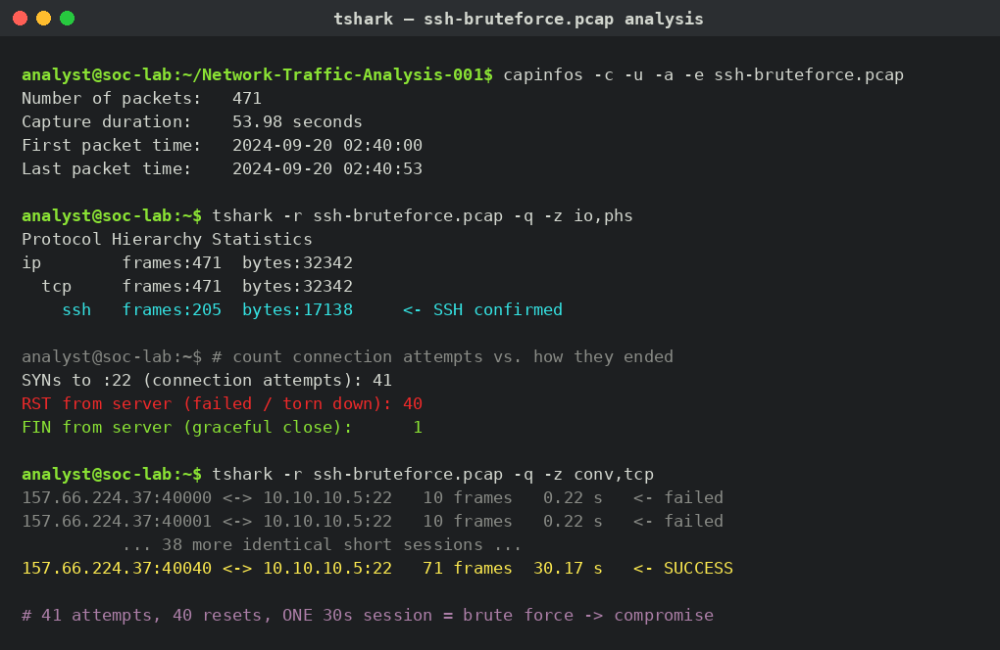

# Network Traffic Analysis — SSH Brute Force to Compromise

| Field | Value |
|-------|-------|
| **Case ID** | Network-Traffic-Analysis-001 |
| **Analyst** | Beltus Bejanga |
| **Tools** | Wireshark / tshark, capinfos, Scapy |
| **Capture** | `ssh-bruteforce.pcap` (471 packets, 54 seconds) |
| **Verdict** | SSH brute force that ended in a successful login (compromise) |
| **Severity** | Critical |

---

## ⚠️ About this capture — it is synthetic

This capture was **generated in a sandbox** by [`generate_capture.py`](generate_capture.py). No real host was scanned or logged into, and no passwords were guessed. The script fabricates packet metadata (IP addresses, ports, TCP flags, timestamps) so the file can be opened and analysed in Wireshark exactly like a live capture.

I built it to practise and demonstrate **network forensics** on the same attack pattern seen in [`IP-Investigation-001`](../IP-Investigation-001) — attacker `157.66.224.37` brute forcing SSH — without attacking anything. The analysis workflow, filters, and conclusions below are identical to what I would run on a real capture.

---

## Scenario

- **Attacker:** `157.66.224.37` (the malicious VPS from IP-Investigation-001)
- **Victim:** `10.10.10.5` (lab host, SSH on `tcp/22`)
- **Pattern:** a rapid burst of short, failed SSH sessions, then one session that stays open — the successful login.

---

## Analysis Walkthrough



*Full `tshark`/`capinfos` session: 41 connection attempts, 40 resets (failures), and one 30-second session (the compromise) standing out from the burst.*

### 1. Capture overview — `capinfos`

```
$ capinfos -c -u -a -e ssh-bruteforce.pcap
Number of packets:   471
Capture duration:    53.98 seconds
First packet time:   2024-09-20 02:40:00
Last packet time:    2024-09-20 02:40:53
```

471 packets in under a minute, all between two hosts — already a sign of automated activity rather than a human typing.

### 2. What protocol? — `tshark -z io,phs`

```
ip    frames:471
  tcp   frames:471
    ssh   frames:205
```

Everything is TCP, and 205 frames are identified as **SSH**. So this is SSH traffic, confirmed by the service banners in the payload (`SSH-2.0-OpenSSH_8.9p1`).

### 3. The tell: many connections, almost all reset

```
$ tshark -r ssh-bruteforce.pcap -Y "tcp.flags.syn==1 && tcp.flags.ack==0 && tcp.dstport==22" | wc -l
41        # 41 connection attempts to SSH

$ tshark -r ssh-bruteforce.pcap -Y "tcp.flags.reset==1 && tcp.srcport==22" | wc -l
40        # 40 sessions torn down with RST  (failed logins)

$ tshark -r ssh-bruteforce.pcap -Y "tcp.flags.fin==1 && tcp.srcport==22" | wc -l
1         # 1 session closed gracefully with FIN
```

**41 attempts, 40 resets, 1 graceful close.** That ratio is the brute-force signature: dozens of short-lived connections that the server drops after a failed auth, hiding one that behaved differently.

### 4. Finding the compromise — conversation durations

```
$ tshark -r ssh-bruteforce.pcap -q -z conv,tcp
157.66.224.37:40000 <-> 10.10.10.5:22   10 frames   0.22 s   <- failed
157.66.224.37:40001 <-> 10.10.10.5:22   10 frames   0.22 s   <- failed
...
157.66.224.37:40040 <-> 10.10.10.5:22   71 frames  30.17 s   <- SUCCESS
```

Every failed attempt is ~10 frames and lasts ~0.2 seconds. **One session — source port 40040 — is 71 frames and lasts 30 seconds.** That is the attacker, now logged in, running an interactive session. This is the single most important packet-forensics lesson here: **after a brute-force burst, the odd-session-out that stays open is your compromise.**

---

## Indicators of Compromise

| Type | Indicator |
|------|-----------|
| Attacker IP | `157.66.224.37` |
| Target service | SSH `tcp/22` on `10.10.10.5` |
| Pattern | 40+ failed auths in <1 min from one source, then a sustained session |
| Successful session | src port `40040`, 30 s duration, graceful FIN close |

---

## MITRE ATT&CK

| Technique | ID |
|-----------|-----|
| Brute Force: Password Guessing | T1110.001 |
| Remote Services: SSH | T1021.004 |
| Valid Accounts (after success) | T1078 |

---

## Detection

- **Wireshark display filter** to isolate the successful session:
  `ssh && ip.addr==157.66.224.37 && tcp.port==40040`
- **Zeek:** `conn.log` would show 40 connections with very short duration and `S0`/`REJ` states, then one long `SF` connection — the same story in logs.
- **Splunk / SIEM:** see [`../Detections/splunk/brute_force_auth.spl`](../Detections/splunk/brute_force_auth.spl), which alerts on *many failures then a success* from one source. That is this exact pattern expressed on authentication logs.

---

## Response

1. Kill the live session on port 40040 and block `157.66.224.37` at the firewall.
2. Treat the targeted account as **compromised**: reset its credentials, review `last`/`wtmp`, shell history, and any processes/cron it created.
3. Move SSH behind a VPN, enforce key-only auth + MFA, and add `fail2ban` so 40 failures triggers an automatic block long before attempt 41.

---

## Reproduce

```bash
pip install scapy
python3 generate_capture.py        # writes ssh-bruteforce.pcap
tshark -r ssh-bruteforce.pcap -q -z conv,tcp
```
